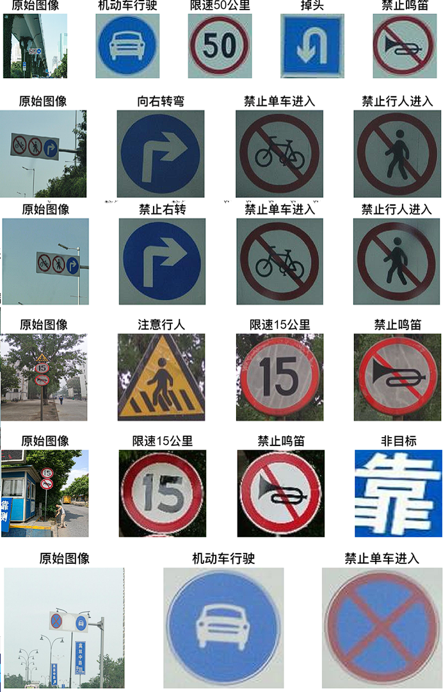

# Chinese Traffic Signs Detection and Recognition

## 项目简介 / Introduction

本项目使用颜色阈值分割和 HOG + SVM 技术检测和识别中国交通标志。检测阶段使用颜色阈值分割图像中的交通标志，识别阶段采用梯度直方图 (HOG) 特征和支持向量机 (SVM) 进行分类。

This project detects and recognizes Chinese traffic signs using color threshold segmentation for localization and HOG + SVM for recognition. The detection phase uses color thresholds to segment traffic signs in images, and the recognition phase employs Histogram of Oriented Gradients (HOG) features combined with a Support Vector Machine (SVM) for classification.

## 功能 / Features

- **交通标志的定位与分割**: 使用颜色阈值分割定位自然环境图像中的交通标志。

- **HOG 特征提取**: 从分割后的图像中提取梯度直方图 (HOG) 特征。

- **SVM 分类**: 使用支持向量机 (SVM) 进行交通标志的识别。

- **中国交通标志数据集**: 包含用于训练的中国交通标志分类数据集（使用 [TT100K_Cropped](https://github.com/oixel64/TT100K_Cropped) 的一个子集）。

- **Color Threshold Segmentation**: Uses color thresholds to segment traffic signs in images.

- **HOG Feature Extraction**: Extracts Histogram of Oriented Gradients (HOG) features from segmented images.

- **SVM Classification**: Utilizes Support Vector Machine (SVM) for recognizing traffic signs.

- **Chinese Traffic Signs Dataset**: Includes a dataset of Chinese traffic signs for training (a subset of TT100K_Cropped).

交通标志图例：


自建 TT100K_Cropped 交通标志分类数据集示例：


## 项目结构 / Project Structure

```bash
Chinese-Traffic-Signs-Detection-and-Recognition/
├── LICENSE
├── README.md
├── code
│   ├── Detection.m                 交通标志定位部分封装函数
│   ├── EXP_Detection_Main.mlx      交通标志定位部分实验过程（可以看到每一步结果）
│   ├── EXP_Recognition_Main.mlx    交通标志识别部分实验过程（可以看到每一步结果）
│   ├── Main.mlx                    交通标志定位与识别展示（MAIN）
│   ├── Recognition.m               交通标志识别部分封装函数
│   ├── createDataSet.m             交通标志识别部分建立数据集封装函数
│   ├── detectRecTrafficSigns.m     交通标志定位与识别总封装函数
│   ├── getClassifier.m             交通标志识别部分训练分类器函数
│   └── getMSERDetail.m             交通标志定位部分标记图像MSER区域各项属性函数(调试用)
└── imgs                            
    ├── test_imgs                   测试图片
    ├── traffic_sign_dataset        各类别交通标志分类器训练集
    └── traffic_sign_example        各类别交通标志图例
```

## 演示 / Demo

以下是本项目的定位和识别效果示例：

**定位**：


----------------

**识别**：



## 许可证 / License

本项目基于 GNU General Public License (GPL) 许可证。详情请参见 LICENSE 文件。

This project is licensed under the GNU General Public License (GPL). See the LICENSE file for details.
